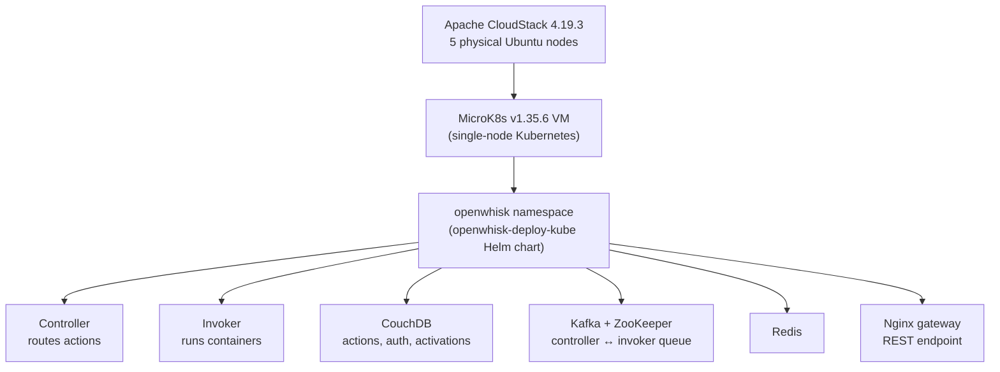

# Cold start latency on a private-cloud OpenWhisk deployment

Practical component of my Master of Information Technology research report at the Eastern Institute of Technology (EIT), New Zealand, 2026:

> *Performance in Serverless Cloud Computing: Challenges, Optimization, and Trade-offs – A Systematic Literature Review and a Practical Validation* (Grade: A-)

Most cold start benchmarks come from AWS Lambda, Azure Functions and Google Cloud. Open-source FaaS platforms on private infrastructure get far less attention. I deployed Apache OpenWhisk on Kubernetes in EIT's private cloud and measured how much a cold start costs compared with a warm one, using OpenWhisk's own activation records rather than client-side timing.

## Result

| Metric | Cold start | Warm start |
|---|---|---|
| Invocations | 26 | 24 |
| Mean | 30.3 ms | 3.3 ms |
| Median | 29 ms | 3 ms |
| Std dev | 6.8 ms | 1.8 ms |
| Min | 24 ms | 2 ms |
| Max | 54 ms | 11 ms |

Cold starts took about nine times longer than warm starts, and the two groups did not overlap at all (Welch t-test, p < 0.001). Warm starts were also far more consistent, so most of the variability comes from container provisioning, not from running the function.

Two things stood out:

- **Container reuse is not guaranteed.** In one of the 25 pairs (runs 1 and 2), the second call, which should have been warm, came back cold. The invoker had not yet made the first container reusable when the second request arrived.
- **Resource contention shows up as outliers.** Two cold starts (46 ms and 54 ms) and one warm start (11 ms) were well above the rest. Everything ran on a single node, so the controller, invoker, Kafka and CouchDB were all competing for the same CPU and disk.

The ~30 ms figure is much lower than the "hundreds of milliseconds" usually reported for Node.js on public clouds. The function had no dependencies, was called directly on the controller's REST API, and ran on a local node with no multi-tenant gateway in front of it, so this is a lower bound rather than a like-for-like comparison.

## Architecture



Resource limits on the shared lab meant OpenWhisk ran on one Kubernetes node rather than across several, as it would in production.

## How cold and warm starts were identified

OpenWhisk adds an `initTime` annotation to an activation record whenever the invoker has to create and initialise a new container. If `initTime` is there, it was a cold start. If not, it was warm. This gives a direct measure of container start-up, separate from network or queuing delay, and it is the kind of detail public cloud providers rarely expose.

My first approach was to redeploy the same action and wait for the container to go idle. That did not work: redeploying an unchanged action did not make the invoker drop its warm container. So I switched to deploying a **new, uniquely named action on every iteration**. Its first call is guaranteed cold, and the call straight after it should be warm.

## Repository contents

```
scripts/action.json     test function: Node.js 14, no dependencies, 256 MB, concurrency 1
scripts/measure.sh      25 iterations: deploy helloN, invoke twice, append responses to a log
scripts/parse.sh        jq: pulls duration and initTime from each activation into a CSV
data/cold_warm_starts.csv   the 50 measurements (Appendix B of the report)
analysis/summary.py     summary statistics, t-test and scatter plot
```

## Reproducing it

1. Deploy OpenWhisk on Kubernetes with the [openwhisk-deploy-kube](https://github.com/apache/openwhisk-deploy-kube) Helm chart and check the pods are running:
   ```bash
   microk8s kubectl get pods -n openwhisk
   ```
2. Make the controller reachable on `localhost:8080` (for example with `kubectl port-forward`) and save the guest auth key (`user:password`) to a file.
3. Run the measurement and parse the log:
   ```bash
   cd scripts
   KEY_FILE=/tmp/k.txt ./measure.sh
   ./parse.sh /tmp/r5.log > ../data/my_run.csv
   grep -o '"initTime"' /tmp/r5.log | wc -l   # number of cold starts
   ```
4. Summarise:
   ```bash
   pip install pandas scipy matplotlib
   python analysis/summary.py
   ```

Your numbers will depend on your hardware and cluster layout. The gap between cold and warm starts is the part that should repeat.

## Infrastructure problems I had to fix

The lab cloud was shared and had been built by earlier students, so getting OpenWhisk to stay up took a fair amount of troubleshooting:

- pods failing and restarting during the Helm install
- CouchDB losing data between restarts until persistence was set up properly
- disk pressure evicting pods, fixed by extending the LVM volume
- a VLAN bridge on one node isolating it from the rest of the cluster

## Limitations

- One dependency-free Node.js function, so no data on how dependencies or other runtimes change the picture.
- Sequential calls only, no concurrent load.
- Single-node cluster, which probably caused the outliers.
- One platform (OpenWhisk) in one configuration.
- 50 invocations is enough to show the cold/warm gap clearly, but not enough to describe rare, extreme cold starts.

## Ideas for further work

- Repeat on a multi-node cluster to separate the cold start itself from single-node contention.
- Add real dependencies and compare runtimes (Python, Java).
- Test under concurrent load, where pre-warm pools run out.
- Run the same test on another open-source platform (e.g. Knative or OpenFaaS) on the same hardware.

## Author

**Sajani Banneka** · Systems Engineer (Linux, AWS, Kubernetes)
[LinkedIn](https://www.linkedin.com/in/sajani-banneka)

Supervisor: Prof. Emre Erturk, EIT.
